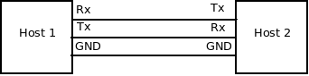
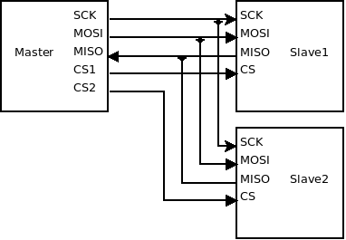
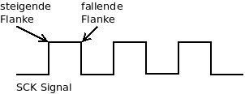
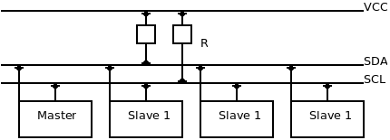
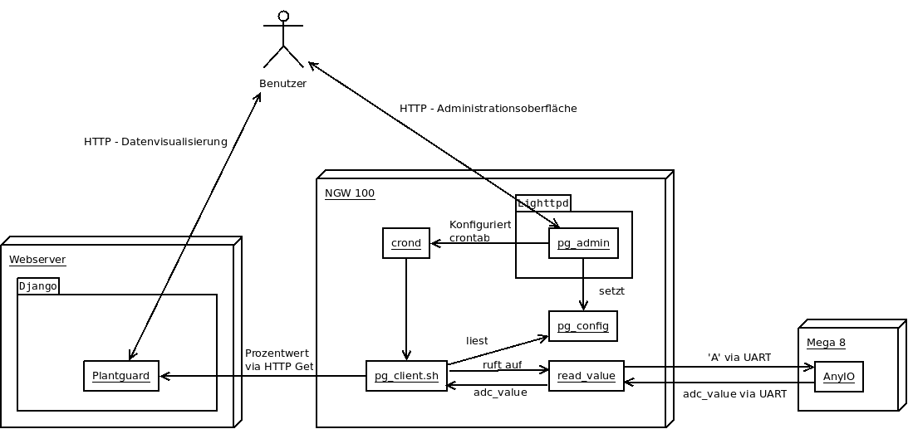
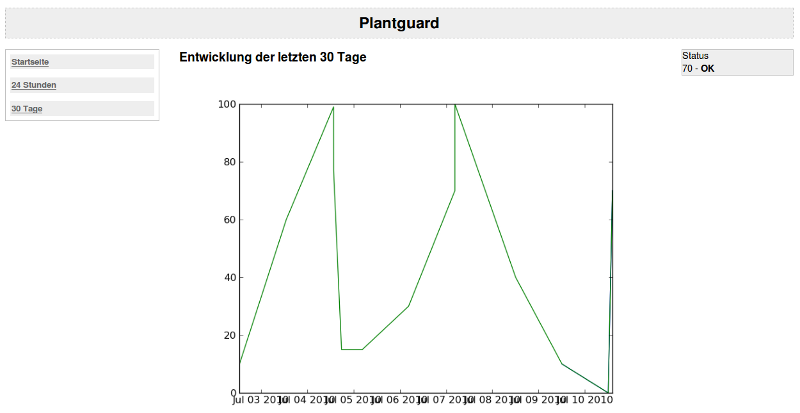
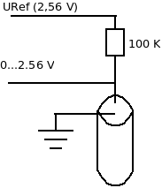

==============================
Bericht Embedded Linux SS 2010
==============================

.. contents:: Inhaltsverzeichnis
  :depth: 3
.. sectnum::
  :depth: 3

Linux auf dem NGW 100
=====================

Inbetriebname des NGW 100
-------------------------
:Autor: Alexander Rampp

Uboot
~~~~~
Upgrade Auf eine neue U-Boot Version
````````````````````````````````````

Da das NGW 100 mit einer relativ alten Version von Uboot ausgeliefert wurde,
musste es zuerst auf eine neue Version upgegradet werden.  Ich entschied mich
dabei für die Variante, das Image über eine SD Karte zu laden, im Folgenden wird
die Vorgehensweise beschrieben:

1. SD-Karte vorbereiten
'''''''''''''''''''''''
1. Flash-Upgrade Image runterladen: ``wget http://www.atmel.no/buildroot/binaries/u-boot/atngw100/u-boot-atngw100-v2008.10.bin``

2. SD-Karte formatieren: ``mk2fs.ext2 /dev/sdxx``
3. Image auf Flashkarte als flash-upgrade.uimg kopieren
4. Flashkarte unmounten

2. Flash-Upgrade starten
''''''''''''''''''''''''
1. Flashkarte in NGW100 stecken und reset Knopf drücken
2. ``Uboot> mmcinit``
3. ``Uboot> ext2load mmc 0:1 0x10400000 /flash-upgrade.uimg``
4. ``Uboot> bootm 0x10400000``
5. Den Anweisungen folgen

Hinweis:
Große SD-Karten werden von U-Boot manchmal nicht erkannt, es kommt dan zu
folgender Fehlermeldung::
  
  .bad MBR sector signature 0x0000
  ** Bad partition 1 **

Abhilfe schafft eine andere, kleinere SD-Karte - bei mir funktionierte eine 512
MB Karte einwandfrei.

Wichtige Umgebungsvariablen in Uboot
````````````````````````````````````
bootargs:
  Der Inhalt dieser Veriable wird dem Linux Kernel als Bootargumente übergeben.
  
bootcmd:
  Beinhaltet einen Commandstring, der automatisch von U-Boot beim starten
  ausgeführt wird.

ipaddr:
  IP von NGW100 wird für tftp gebraucht.

serverip:
  Adresse des tftp servers.

Wichtige Kommandos in Uboot
```````````````````````````
bootm <Addr>:
  Booten von der angegebenen Speicheradresse.

setenv <Variable> <String>:
  Setzt Umgebungsvariablen.

askenv <Variable>:
 Alternatives Kommando zum Setzen von Umgebungsvariablen, frägt Interaktiv nach
 dem Wert der Variablen (bei sehr langen Werten hilfreich).

saveenv:
  Sichert die Umgebungsvariablen in den Flash Speicher, so dass sie den Neustart
  überleben.

Booten per NFS
``````````````
Wir gehen davon aus, dass NFS auf dem Host korrekt eingerichtet ist. Unter
/srv/ngw100 liegt das Root-Dateisystem und unter /srv/ng100/uImage das
KernelImage. IP Des Hosts: 192.168.1.8, IP des Targets: 192.168.1.4::

  U-Boot> nfs 11000000 192.168.1.8:/srv/ngw100/boot/uImage
  U-Boot> setenv bootargs 'root=nfs nfsroot=192.168.1.8:/srv/ngw100
  ip=192.168.1.4:192.168.1.8::255.255.255.0::eth0:none'
  U-Boot> bootm

Beim Laden des Kernels kommt es zu folgender Fehlermeldung: 
``ERROR: Cannot umount``
Der Kernel wurde aber trozdem geladen - die Meldung kann ignoriert werden.

Kommt es während des Bootvorgangs zu folgendem Fehler:
``Warning: unable to open an initial console.``

Schafft folgendes Workaround abhilfe:
Aufdem Host:
``sudo cp -a /dev/{console,null} /srv/ngw100/dev``

Hintergrund ist, dass versucht wird auf dem Host mit 'mknod' die beiden Devices
anzulen, dies aber fehlschlägt, weil dieser Befehl nur mit Rootrechten
ausgeführt werden kann.


Probleme und Lösungen
~~~~~~~~~~~~~~~~~~~~~

Der Folgende Teil enthält einige Problembeschreibungungen und die von mir dazu
erarbeiteten Lösungen.

Dropbear lässt sich nicht starten / komische Logmeldungen
`````````````````````````````````````````````````````````

Problem
'''''''
* Dropbear bleibt beim generieren der Keys hängen.
* Dropbear scheint korrekt zu starten, man kann sich ber SSH einloggen
* In /var/log/messages tauchen folgende Meldungen auf:
  "Warning: Reading the random source seems to have blocked.
  If you experience problems, you probably need to find a better entropy
  source."

Lösung
''''''
In */etc/init.d/S50dropbear* Code am Anfang der *start()* Funktion einfügen::
  
  #workaround for /dev/randomproblem
  mv /dev/random /dev/random-blocks
  ln -s /dev/urandom /dev/random

Hintergrund
'''''''''''

* Quelle: http://www.nslu2-linux.org/wiki/Unslung/KnownProblems
* Hintergrundinfos: http://people.freebsd.org/~dougb/randomness.html


/usr/ wird nicht über nfs geladen
`````````````````````````````````
Problem
'''''''
* Wird ein Programm auf dem Host z. B. nach /usr/bin kopiert, ist es nicht auf
  dem Target auffindbar

Lösung
''''''
Sieht man sich /etc/fstab an, sieht man darin folgenden Eintrag::
  /dev/mtdblock3  /usr            jffs2           defaults        0       0

Scheinbar wird also /usr vom Flashspeicher eingebunden. Kommentiert man diese
Zeile aus (# davor), wird /usr nach einem Neustart über nfs geladen.


.. _cgiHttpd:

CGI und lighttpd
----------------
:Autor: Alexander Rampp

Sehr praktisch ist die Möglichkeit, auf das NGW100 über eine Weboberfläche
zuzugreifen.  Am einfachsten geht dies per CGI (Common Gateway Interface),
einer Schnittstelle zum Datenaustausch zwischen einem Webserver und
Drittsoftware.  Zudem legt man sich mit CGI nicht auf eine Programmiersprache
fest, sondern kann nahezu jedes Programm vom Webserver aus ausführen.  Ein
Nachteil von CGI ist bei größeren Anwendung allerdings die geringe
Geschwindigkeit.  Bei jedem Aufruf muss ein neuer Prozess gestartet werden, was
bei hochfrequentierten Seiten schnell zur Überlastung des Servers führt.  Diesem
Problem begegnet man heutzutage meist, indem man die Interpreter von
Skriptsprachen direkt in den Webserver einbettet (z. B. mod_perl, mod_php,
mod_python bei Apache).  Da auf einer Adminoberfläche für ein Embedded Device
aber meist nur ein Benutzer gleichzeitig arbeitet, reicht für diesen
Anwendungsfall CGI völlig aus. 

lighttpd
~~~~~~~~
Als Webserver kommt *lighttpd* zum Einsatz, da dieser sehr
leichtgewichtig aber doch sehr mächtig ist.  Ähnlich wie Apache lässt er sich
durch Module erweitern.  Darüber hinaus bietet er einige weitere interessante
Mermale:
 
 - FASTCGI, SCGI
 - Lässt sich in einer chroot Umgebung betreiben
 - SSL und TLS
 - Server Side Includes
 - Java-Servlet Unterstützung
 - HTTP-Kompression

Im Gegensatz zu großen Webservern lässt sich lighttpd sehr einfach über ein Perl
Skript konfigurieren.  In der Regel legt man dieses Skript unter
*/etc/lighttpd.conf* ab. Im folgenden werden die wichtigsten
Konfigurationsoptionen an einer Beispielkonfiguration vorgestellt::

  # Module die geladen werden sollen

  server.modules = (
  "mod_access",   # Zugriff auf bestimmte Dateien verbieten
  "mod_cgi"       # CGI support
  )
  
  # Bestimmt wo die Dokumente liegen sollen
  server.document-root = "/www/"

  # Logfile  
  server.errorlog = "/var/log/lighttpd.log"

  # Index Datein (beim Aufruf von z. B. www.example.com wird nach diesen
  # Dateinamen gesucht
  server.indexfiles = ("index.html", "index.htm", "index.cgi", "index.sh",
  "index.py" )

  # Serverport (default 80)
  server.port = 80                                                                                                        
  # CGI Konfiguration
  # Syntax <FileExtension> => <Interpreter>
  cgi.assign = (
  ".py" => "/usr/bin/python", # Python Skripte
  ".sh" => "/bin/bash"        # Shell Skripte
  )

  # Mapping von Dateiendungen zu Mimetypes
  mimetype.assign = (
    ".css" => "text/css",
    ".html" => "text/html",
    ".htm" => "text/html",
    ".js" => "text/javascript",
    ".pdf" => "application/pdf",
  }

Da das lighttpd Paket aus Buildroot kein Startskript mitbringt, habe ich selbst
eins geschrieben, sodass der Server automatisch startet und sich einfach steuern
lässt::

  #!/bin/sh
  
  HTTPD=/usr/sbin/lighttpd 
  CONFIGFILE=/etc/lighttpd.conf
  
  
  if [ ! -x "${HTTPD}" ]; then
      echo ${HTTPD} "not found missing"
      exit 1
  fi
  if [ ! -r ${CONFIGFILE} ]; then
      echo "Configuration at " ${CONFIGFILE} "not found or not readable"
      exit 1
  fi
  
  
  case "$1" in
      start)
          echo -n "starting lighttpd... "
          if ${HTTPD} -f ${CONFIGFILE}; then
  	    echo "[done]"
          else
  	    echo "[failed]"
  	    exit 1
          fi
          ;;
      stop)
          echo -n "stopping lighttpd... "
          if killall $(basename ${HTTPD}); then
              echo "[done]"
          else
              echo "[failed]"
              exit 1
          fi
          ;;
      restart)
          echo -n "restarting lighttpd... "
          if killall $(basename ${HTTPD}) && ${HTTPD} -f ${CONFIGFILE}; then
              echo "[done]"
          else
              echo "[failed]"
              exit 1;
          fi
          ;;
  esac
  exit 0

Zuerst überprüft das Skript, ob das Binary des Servers ausführbar und die
Konfigurationsdatei lesbar ist.  Dann wird das erste Argument ausgewertet und
der Server entsprechend gestartet, gestoppt oder neugestartet.  Ist das Skript
unter */etc/init.d/S42lighttpd* hinterlegt und ausführbar gemacht (*chmod +x
S42lighttpd*), kann es wie folgt verwendet werden::

  /etc/init.d # ./S42lighttpd start
  starting lighttpd... [done]
  /etc/init.d # ./S42lighttpd stop 
  stopping lighttpd... [done]
  /etc/init.d # ./S42lighttpd start
  starting lighttpd... [done]
  /etc/init.d # ./S42lighttpd restart
  restarting lighttpd... [done]

CGI
~~~
Hat man des Server erfolgreich konfiguriert, kann man CGI Skripte darauf
ausführen.  Um Parameter an das Skript zu übergeben kann man kann man die
HTTP-Methoden *GET* oder *POST* verwenden.

GET
  Bei der GET Methode werden die Argumente einfach an die URL angehängt.  Ein
  '?' ist dabei das Trennzeichen.  Beispiel
  http://www.example.com?name=Alex&type=Student . In der Umgebungsvariable
  *QUERY_STRING* befindet sich dann: "name=Alex&type=Student".

POST
  Bei einem Post Request werden die Daten direkt als zusätzliche Einträge in den
  HTTP Request geschrieben.  Ein CGI Skript bekommt diese Daten über die
  Standarteingabe übergeben.  In der Umgebungsvariable *CONTENT_LENGTH* befindet
  sich zudem die Anzahl der Zeichen, die bei dem Request übergeben wurden.

Um etwas zurück an den Webbrowser zu senden, muss man lediglich auf die
Standardausgabe schreiben.  Das folgende Skript ermöglicht es, die beiden GPIO
Leds auf dem NGW100 über eine (sehr einfach gehaltene) Weboberfläche ein- und
auszuschalten::

  #!/bin/bash
  
  FILE_A=/sys/class/leds/a/brightness
  FILE_B=/sys/class/leds/b/brightness
  
  
  message="default"
  if [ ${QUERY_STRING} = "A" ]; then
      message="A"
      br=$(cat $FILE_A)
      if [ $br -ne 0 ]; then
          echo 0 > $FILE_A
          message="null"
      else
          echo 1 > $FILE_A
          message="eins"
      fi
  elif [ ${QUERY_STRING} = "B" ]; then
      br=$(cat $FILE_B)
      if [ $br -ne 0 ]; then
          echo 0 > $FILE_B
      else
          echo 1 > $FILE_B
      fi
  fi
  
  echo "<!DOCTYPE HTML PUBLIC \"-//W3C//DTD HTML 4.01 Transitional//EN\"
         \"http://www.w3.org/TR/html4/loose.dtd\">
         <html>
         <head>
         <title>Beschreibung der Seite</title>
         </head>
         <body>
           <a href=\"/cgi-bin/test.sh?A\">Led A</a><br />
           <a href=\"/cgi-bin/test.sh?B\">Led B</a><br />
         </body>
         </html>
       
  "


Schnittstellen
==============

GPIO
----
:Autor: Alexander Rampp

Mit dem GPIO Interface können Pins einzeln angesprochen werden. Dazu muss GPIO
zürst im Kernel aktiviert werden:

* in Buildroot: ``make linux26-menuconfig``
* Haken setzen unter Device Drivers --> GPIO Support -->
  /sys/class/gpio/.. (sysfs interface)
* in Buildroot: ``make``

Anschließend ist das GPIO Sysfs Interface unter /sys/class/gpio verfügbar.

LED über GPIO ansteuern:
~~~~~~~~~~~~~~~~~~~~~~~~
Eine Leuchtdiode wird an PA04 (das ist Pin 7 auf J5) gegen GND angeschlossen (WICHTIG: LED
NIEMALS OHNE VORWIDERSTAND ANSCHLIESSEN!!!). Um Zugriff auf den Pin zu bekommen,
muss er erstmal konfiguriert werden, danach kann man ihn beliebig auf high
bzw. low setzen und die LED geht an bzw. aus::

  $ echo 4 > /sys/class/gpio/export               # erstellt unter /sys/class/gpio/gpio4 das API für den PIN
  $ echo "out" > /sys/class/gpio/gpio4/direction  # Pin als Ausgang konfigurieren
  $ echo 1 > /sys/class/gpio/gpio4/value          # Ausgang auf "High" setzen
  $ echo 0 > /sys/class/gpio/gpio4/value          # Ausgang auf "Low" setzen
  $ echo 4 > /sys/class/gpio/unexport             # Pin freigeben

UART
----
:Autor: Alexander Rampp

Der "Universal Asynchronous Receiver Transmitter" (UART) ist ein Bauelement, das
die serielle Datenübertragung zwischen zwei Geräten realisiert. Physisch besteht
das ganze aus 3 Adern:

Rx
  "Receive" - Daten werden empfangen
Tx
  "Transmit"  - Daten werden gesendet
GND
  "Ground" - gegenüber dieser Leitung wird die Spannung von Rx und Tx
  gemessen




UART arbeitet in einem Spannungsbereich von ca. 0 - 3,3 Volt. Die RS232
Schnittstelle (serielle Schnittstelle am PC) arbeitet in einem Spannungsbereich
von ca. -15 - +15 Volt. D. h. möchte man RS232 mit UART verbinden, ist ein
Pegelwandler nötig.


Das NGW 100 bietet 4 UART Schnittstellen. UART1 ist dabei an die Serielle
Konsole gebunden, die anderen Schnittstellen stehen zur freien Verfügung.  Die
Schnittstellen sind über folgende Pins auf dem Board erreichbar:

- USART 0: Port PA06 - Port09
- USART 1: Port PA20 bzw. Serielle Konsole
- USART 2: Port PB26 - PB27
- USART 3: Port PB15 - PB19


Einbinden in Linux
~~~~~~~~~~~~~~~~~~
Die UART Schnittstelle muss im Linuxkernel aktiviert werden. Dazu wird 
die Datei ``arch/avr32/boards/atngw100/setup.c`` im Kernelverzeichnis
bearbeitet.  In der Funktion ``setup_board(void)`` wird unter folgender Code
eingefügt um UART 2 und 3 zu aktivieren::

  at32_map_usart(2, 1); /* USART 2: /dev/ttyS1 */
  at32_map_usart(3, 2); /* USART 3: /dev/ttyS2 */

Damit die Schnittstelle auch unter ``/dev`` verfügbar ist, fügt man in der
Funktion ``atngw100_init(void)`` folgenden Code ein::

 at32_add_device_usart(1);
 at32_add_device_usart(2);

Anschließend wird der Kernel neu kompiliert, die Schnittstellen stehen nun
unter ``/dev/{ttyS1,ttyS2}`` zur Verfügung.

Ansteuerung mit C
~~~~~~~~~~~~~~~~~

Überblick
`````````

Da es sich bei den Schnittstellen ``/dev/ttyS*`` um Characterdevices handelt,
können diese einfach wie eine Datei angesteuert werden. Beispiel::

 char[] text = "Hallo Welt";
 int fd = open( "/dev/ttyS1", O_RDWR );
 write( fd, text, strlen( text );
 close(fd);

In der Standardkonfiguration geben die Schnittstellen gesendete Bytes wieder
zurück, wie es im Terminalbetrieb üblich ist.  Dies möchte man bei einer
normalen Datenübertragung natürlich nicht haben.  Mit dem Struct ``termios``,
definiert in ``asm/termios.h`` kann man die Schnittstelle entsprechend
konfigurieren::

 #define NCCS 19
 struct termios {
   tcflag_t c_iflag;		/* input mode flags */
   tcflag_t c_oflag;		/* output mode flags */
   tcflag_t c_cflag;		/* control mode flags */
   tcflag_t c_lflag;		/* local mode flags */
   cc_t c_line;			/* line discipline */
   cc_t c_cc[NCCS];		/* control characters */
 };

``c_iflag``
  Flags die bestimmen, wie eingehende Zeichen vorverarbeitet werden.

``c_oflag``
  Flags, die bestimmen wie ausgehende Zeichen nachbearbeitet werden.

``c_cflag``
  Kontrolliert Einstellungen für den Port, z. B. Baudrate, Bits per Zeichen,
  Stop Bits, etc.

``c_lflag``
  Konfiguriert ob Zeichen zurrückgesendet werden, wie das eigene Programm
  signalisiert wird, etc.

``c_line``
  In POSIX konformen Systemen unbenutzt.

``c_cc``
  Definiert Steuerzeichen wie z. B. EOF (End of File), Stop Characters, etc.

Eingabekonzepte
```````````````
Es gibt verschiedene Konzepte, eingehende Bytes zu behandeln.  Um die
Konformität zu Manpages und anderen HOWTOs zu wahren, verwende ich die
englischen Bezeichnungen.

Canonical Input Processing
  Dieser Eingebaemodus arbeitet zeilenorientiert. D. h. jeder ``read``
  Aufruf gibt eine komplette Zeile zurrück.  Als Zeilenende wird dabei der Unix
  Line-Feed (ASCII ``LF``) interpretiert.

Non-Canonial Input Processing
  Hierbei wird eine fixe Anzahl von Zeichen bei jedem ``read``
  gelesen.

Asynchroner Input
  Sowohl Canonical, als auch Non-Canonical kann synchron (standard) oder
  asynchron gelesen werden.  Beim synchronen Lesen blockt ``read`` so lange,
  bis etwas gelesen wurde.  Beim asynchronen Lesen kehrt ``read`` hingegen
  sofort zurück und schickt ein Signal, sobald etwas gelesen wurde.

In diesem HOWTO beschränke ich mich auf synchronen Canonical Input, für die
anderen Modi,
siehe `Serial Programming HOWTO <http://www.tldp.org/HOWTO/Serial-Programming-HOWTO/index.html>`_.


Konfiguration der Schnittstelle
```````````````````````````````
Zur Konfiguration der Schnittstelle stellt ``termios.h`` folgende Funktionen
zur Verfügung:

``int tcgetattr (int __fd, struct termios *__termios_p)``
  Schreibt die aktuelle Konfiguration in das übergebene termios Struct

``extern int tcsetattr (int __fd, int __optional_actions, __const struct termios *__termios_p)``
  Schreibt eine neue Konfiguration in die Schnittstelle

Um nun Canonical Input Processing zu konfigurieren müssen folgende Flags gesetzt werden
(Codebeispiel vom Serial Programming HOWTO)::

 #define BAUDRATE B38400
 struct termios newtio;
 
 /* 
   BAUDRATE: Set bps rate. You could also use cfsetispeed and 
             cfsetospeed.
   CRTSCTS : output hardware flow control (only used if the
             cable has all necessary lines. See sect. 7 of 
             Serial-HOWTO)
   CS8     : 8n1 (8bit,no parity,1 stopbit)
   CLOCAL  : local connection, no modem contol
   CREAD   : enable receiving characters
 */
 newtio.c_cflag = BAUDRATE | CRTSCTS | CS8 | CLOCAL | CREAD;
   
 /*
   IGNPAR  : ignore bytes with parity errors
   ICRNL   : map CR to NL (otherwise a CR input on the other
             computer will not terminate input) otherwise make 
             device raw (no other input processing)
 */
 newtio.c_iflag = IGNPAR | ICRNL;
   
 /*
   Raw output.
 */
 newtio.c_oflag = 0;
   
 /*
   ICANON  : enable canonical input
   disable all echo functionality, and don't send signals to
   calling program
 */
 newtio.c_lflag = ICANON;

Die entsprechenden Flags sind in ``termios.h`` definiert.


SPI
---
:Autor: Alexander Rampp

Beim Serial Peripheral Interface handelt es sich um einen von Motorola
entwickelten, seriellen Bus Standard, bei dem Schaltungen nach dem Master-Slave
Prinzip verbunden werden.  SPI ist vor allem wegen seiner schnellen
Datenübertragung (bis zu 10 MHz) im Fullduplex Modus interessant.  Zudem können
mit einem SPI Device mehrere Geräte angesteuert werden.


Eigenschaften
~~~~~~~~~~~~~





Für eine SPI Verbindung sind vier Adern nötig:

- MISO - Master in Slave out
- MOSI - Master out Slave in
- SCK - Serial Clock
- CS - Chip Select

Über *MISO* bzw. *MOSI* können gleichzeitig Daten übertragen werden
(vollduplex), *SCK* gibt ein Taktsignal vor und mit *CS* wird der
anzusprechende Slave ausgewählt.  Dabei ist immer der Slave aktiv, bei dem eine
logische 0 anliegt.


Jeder SPI Baustein kann als *Master* oder *Slave* betrieben
werden. Der Baustein, der sich im Master Modus befindet, gibt das Taktsignal vor
und kontrolliert die Chip-Select Leitungen.  Dadurch ergibt sich, dass in einem
SPI Netz immer nur ein Master aktiv sein kann.  Die Anzahl der Slaves ist
dagegen nur durch die Anzahl der Chip Select Leitungen begrenzt.


Realisiert werden die Puffer an *MOSI* bzw *MISO* mit
Schieberegistern.  Die Länge der Schieberegister ist dabei unspezifiziert und
kann bei den einzelnen Bausteinen abweichen.


SPI Modi
````````
Motorola hat die eigentliche Datenübertragung bei SPI nicht spezifiziert.  In
der Praxis jedoch haben sich vier Modi herausgebildet.  Konfiguriert werden
diese über die Bits *CPOL* (Clock Polarity) und *CPHA* (Clock Phase)
des SPI Control Registers (*SPCR*).
*CPOL* definiert ob der Zustand logisch 1 oder logisch 0 als aktiv
angesehen wird.  *CPHA* definiert ob die Datenübertragung bei steigender
oder fallender Taktflanke beginnt.




+-----------+------+------+
| SPI Modus | CPOL | CPHA |
+===========+======+======+
|     0     |   0  |  0   |
+-----------+------+------+
|     1     |   0  |  1   |
+-----------+------+------+
|     2     |   1  |  0   |
+-----------+------+------+
|     3     |   1  |  1   |
+-----------+------+------+
    
Für eine funktionierende Datenübertragung muss sicher gestellt werden, dass
sowohl Master, als auch alle Slaves auf den gleichen Modus konfiguriert sind


Einbinden in Linux
~~~~~~~~~~~~~~~~~~

Vor Benutzung muss die SPI Schnittstelle im Linux Kernel aktiviert werden.  Beim
NGW 100 muss dazu die Datei *arch/avr32/boards/atngw100/setup.c* bearbeitet
werden.  Folgender Code legt die Schnittstelle an::


  static struct spi_board_info spi1_board_info[] __initdata = {
    {
      .modalias       = "spidev",
      .max_speed_hz   = 8000000,
      .chip_select    = 0,
    },
  };

Um die Schnittstelle zu aktivieren, ist noch folgender Aufruf notwendig::

  at32_add_device_spi(1, spi1_board_info, ARRAY_SIZE(spi1_board_info));


Anschließend ist ein neues Kernelmodul, welches mit dem Shell Befehl *modprobe
spidev* geladen werden kann, vorhanden.  Danach befinden sich die Geräte unter
*/dev*, z. B. */dev/spidev1.0* (Schnittstelle 1, Chip Select 0).

Ansteuern
~~~~~~~~~

*open()* und *close()* Operationen auf den spi Devices funktionieren
wie erwartet.  *read()* und *write()* arbeiten aber nur halb-duplex.
Deshalb empfielt die Treiberdokumentation die Datenübertragung mit
dem *ioctl()* Request *SPI_IOC_MESSAGE*.


Der Treiber bietet folgende *ioctl()* Requests an.  Ein gutes Codebeispiel
findet man im Linuxkernel unter `Documentation/spi/spidev_test.c
<http://lxr.lfinux.no/#linux+v2.6.34/Documentation/spi/spidev_test.c>`_.

*SPI_IOC_RD_MODE, SPI_IOC_WR_MODE*
  Liest (RD) bzw. setzt (WR) den SPI-Mode mit dem übergebenen Zeiger.  Es
  existieren Konstanten (*SPI_MODE_0* - *SPI_MODE_3*) für die
  entsprechenden Werte.

*SPI_IOC_RD_LSB_FIRST, SPI_IOC_WR_LSB_FIRST*
  Liest (RD) bzw. setzt (WR) die Bitwertigkeit der SPI Wörter.  *0*
  heißt, das höchstwertige Bit ist an erster Stelle (msb-first), bei anderen
  Werten steht das höchstwertige Bit an letzter stelle (lsb-first).  Siehe dazu
  auch den Wikipedia Artikel `Bitwertigkeit <http://de.wikipedia.org/wiki/Bitwertigkei>`_.

*SPI_IOC_RD_BITS_PER_WORD, SPI_IOC_WR_BITS_PER_WORD*
  Liest (RD) bzw. setzt (WR) die Wortlänge in Bits mit einem übergebenen
  Zeiger. Der Wert *0* steht für 8 Bit.

*SPI_IOC_RD_MAX_SPEED_HZ, SPI_IOC_WR_MAX_SPEED_HZ*
  Liest (RD) bzw. setzt (WR) die Übertragungsgeschwindigkeit in HZ mit einem
  übergebenen Zeiger

*SPI_IOC_MESSAGE(n)*
  Überträgt Daten via SPI.  Als Parameter wird der Zeiger auf eine Instanz
  des structs *spi_ioc_transfer* übergeben, *n*
  ist die Länge des Transferarrays.  Das o. g. Struct enthält u. a. die
  Felder *tx_buf* (transfer buffer) und *rx_buf* (receive buffer).


I2C
---
:Autor: Alexander Rampp

Eigenschaften
~~~~~~~~~~~~~

Der *Inter-Integrated Circuit* (I2C oder auch TWI für *Two Wire Interface*) ist
ein von Philips in den 1980er Jahren entwickelter Serieller Bus.  Ziel war es,
die Kommunikation unter verschiedenen Geräten mit möglichst wenigen Leitungen zu
ermöglichen.



Der I2C kommt mit zwei Leitungen aus.  *SDA* (Serial Data) überträgt die
eigentlichen Daten.  *SCK* (Serial Clock) stellt ein Taktsignal zur Verfügung.
Beide Leitungen sind über einen Pullup Widerstand mit der Versorgungsspannung
(VCC) verbunden.  In jedem I2C gibt es einen Master Baustein, der den Takt vorgibt
sowie eine Kommunikation initiiert.  Es gibt auch Multi-Master Systeme, auf die
hier aber nicht näher eingegangen wird.

Ursprünglich war I2C für eine Übertragungsgeschwindigkeit von 100 kHz
spezifiziert.  Heutige Bausteine arbeiten aber in der Regel mit 400 kHz.  Zudem
gibt es einen High-Speed-Mode mit bis zu 3,4 MHz, allerdings sind diese
Bausteine nicht zu 100 bzw. 400 kHz Bausteinen kompatibel.

Eine Adresse bei I2C besteht immer aus 8 Bit.  Die ersten vier Bit sind dabei
vom Hersteller vorgegeben, die nächsten drei Bit können frei konfiguriert
werden.  Das achte Bit zeigt an, ob auf den Baustein lesend oder schreibend
zugegriffen wird.  Es gibt eine Erweiterung der Adresse auf 10 Bit, auf die in
diesem Artikel aber nicht weiter eingegangen wird.

+---------+-------------+-----+
| Adresse | Sub-Adresse | R/W |
+-+-+-+---+-+-+---------+-----+
|0|1|1|0  |0|1|1        | 1   | 
+-+-+-+---+-+-+---------+-----+

Wie läuft nun eine typische Kommunikation ab?

#. Master sendet Startsequenz.
#. Master sendet Angeforderte Adresse.
#. Jeder Slave vergleicht die gesendete Adresse mit der eigenen.
#. Der angesprochene Slave schickt ein *ACK* Signal.
#. Master bzw. Slave (abhängig vom R/W Bit) sendet Daten.
#. Master sendet Stop Sequenz und gibt somit den Bus wieder frei.

Ansteuern unter Linux
~~~~~~~~~~~~~~~~~~~~~

Standartmäßig ist die Schnittstelle im Kernel (zumindest bei der Buildroot
Distribution) schon aktiviert.  Man läd den Treiber, indem man die Module
*i2c-core*, *i2c-dev* und *i2c-gpio* einbindet.  Zum Beispiel mit Modprobe::

  $ modprobe i2c-core
  $ modprove i2c-dev
  $ modprove i2c-gpio

Anschließend kann man über die Gerätedatei /dev/i2c-0 auf den Bus zugreifen.
I2C kann nun auf zwei Arten angesteuert werden: Über das read/write Interface
oder über das ioctl Interface.

Aus Gründen der Übersichtlichkeit verzichte ich bei den folgenden Code
Beispielen auf die Fehlerbehandlung.  In der Praxis sollte man natürlich jeden
Systemcall auf einen Rückggabewert < 1 überprüfen und den Fehler entsprechend
behandeln.

Bevor man überhaupt was ansteuern kann, muss man die Gerätedatei natürlich erst
einmal öffnen::

  int device_file;
  device_file = open("/dev/i2c-0", O_RDWR);


Das Read/Write Interface
````````````````````````

Vor der Datenübertragung muss die Slave Adresse gesetzt werden.  Das ist die
Adresse des Gerätes, mit dem wir kommunizieren wollen::

  int slave_address = 0x12;
  ioctl(device_file,I2C_SLAVE,slave_address);

Nun erstellt man sich ein Bytearray mit den Daten, die man schreiben will.  Der
erste Eintrag des Arrays entspricht dabei dem Register, das man im Slave
beschreiben will. Mit einfachen Read/Write System Calls kann man anschließend
die Daten übertragen::

  buffer[0] = 0x1e /* Register 0x1e im Slave */
  buffer[1] = 0xff /* Erstes Datenbit */
  buffer[2] = 0xe1 /* Zweites Datenbit */

  /* Daten in Register schreiben */
  write(device_file, buffer, 3);

  /* Daten auslesen */
  read(device_file, buffer, 1);
  /* buffer[0] enthält das gelesene Byte */

Das ioctl Interface
```````````````````

Das ioctl bietet mehr Möglichkeiten als das read/write Interface.  Man kann
dabei über das I2C oder das SMB (ein mit I2C verwantes Protokoll) Protokoll
kommunizieren.  Da nicht alle Bausteine SMB beherrschen beschränke ich mich hier
auf das I2C Protokoll.

Die Headerdateien *linux/i2c-dev.h*  und */linux/i2c.h* stellen dafür zwei
Structs zur Verfügung::

  /* This is the structure as used in the I2C_RDWR ioctl call */
  struct i2c_rdwr_ioctl_data {
  	struct i2c_msg *msgs;	/* pointers to i2c_msgs */
  	__u32 nmsgs;			/* number of i2c_msgs */
  };

  struct i2c_msg {
 	__u16 addr;	/* slave address			*/
  	__u16 flags;
	__u16 len;		/* msg length				*/
	__u8 *buf;		/* pointer to msg data			*/
  };

- ``addr`` ist die Slave adresse
- ``flags`` bestimmt ob geschrieben oder gelesen wird, bei der 10 Bit
  Adressierung gibt es noch weitere Flags (siehe *i2c.h*)
- ``len`` Anzahl der Bytes, die gelesen oder geschrieben werden sollen
- ``buf`` Zeiger auf den Puffer, der die zu schreibenden Daten enthält bzw. wo
  die zu lesenden Daten hingeschrieben werden.

Das folgende Beispiel überträgt zwei Bytes an einen Slave::

  struct i2c_rdwr_ioctl_data ioctl_data;
  uint8_t msg_data[2] = {0,0};
  ioctl_data.nmsgs = 1;
  ioctl_data.msgs = (struct i2c_msg*) malloc(ioctl_data.nmsgs *
  sizeof(struct i2c_msg));
  ioctl_data.msgs[0].len = 2;
  ioctl_data.msgs[0].flags = 0;
  ioctl_data.msgs[0].addr = 0x1; /* slave address */
 
  msg_data[0] = 0x1; /* register address*/
  msg_data[1] = 0xA; /* data */
  msg_data[2] = 0xB; /* data */
  
  ioctl_data.msgs[0].buf = msg_data;
  ioctl(message.device_handle, I2C_RDWR,(unsigned long) &ioctl_data) 


Projekt: Plantguard - Bodenfeuchtigkeitsmessung im Blumenkasten
===============================================================
:Autor: Alexander Rampp

Das Ziel von Plantguard ist, die Bodenfeuchtigkeit eines Blumenkastens zu messen
und diese Messwerte in einer Webapplikation zu Visualisieren.  Die Daten sollten
weltweit abrufbar sein, weshalb die Visualisierung nicht auf dem NGW 100,
sondern auf einem externen Webserver stattfindet.  Folgendes Diagramm stellt die
Architektur der Anwendung dar:



Am A/D Wandler des Mega8 wird ein selbst gebauter Feuchtigkeitsmesser (siehe
unten) angeschlossen.  Über den A/D Wandler wird der Widerstand im Sensor
gemessen und über UART an das NGW zurück gegeben.  Auf dem NGW wird dieser
Rohwert in einen Prozentwert (100 = sehr feucht, 0 = sehr trocken) umgewandelt.
Dieser wird über eine HTTP Schnittstelle an die Webapplikation übergeben, die
sie zusammen mit einem Zeitstempel in einer Datenbank speichert.

Im Folgenden werden die einzelnen Komponenten der Anwendung genauer beschrieben.

Webserver / Django
------------------

`Sourcecode <http://github.com/BitSchupser/elinux/tree/master/programs/plantguard/webapp/plantguard/>`_

Auf dem Webserver kommt eine `Django <http://www.djangoproject.com/>`_
Webapplikation zum Einsatz.  Django ist ein Python Webframework, das das sehr
schnelle und einfache entwickeln von Webanwendungen unterstützt.  Dazu bringt es
allerlei Tools und Bibliotheken (z. B. eine Template Engine, einen O/R Mapper,
Authentifizierung, etc.) mit.  Zudem wollte ich Django schon lange einmal
ausprobieren und dies bot sich im Rahmen dieses Projektes einfach an.

Die Django Anwendung besteht streng genommen aus zwei Teilen.

Zum einen wird eine HTTP Schnittstelle angeboten um auf einfache Weise neue
Daten abzuspeichern.  Ein Aufruf sieht z. B. so aus:
http://www.example.com/store/50/password .  Hierbei wird die 'store' Funktion
(welche einen neuen Datensatz anlegt) aufgerufen.  Diese überprüft zuerst, ob
der zweite Parameter (hier 'password') dem richtigen Passwort entspricht und
schreibt anschließen den ersten Parameter (hier '50') zusammen mit einem
Zeitstempel in die Datenbank.  War alles erfolgreich, wird der HTTP Statuscode
200 ('OK') zurück gegeben, war das Kennwort falsch, wird 403 ('Forbidden')
zurückgegeben.  Dieser sehr einfache Authentifizierungsmechanismus ist natürlich
keineswegs sicher und sollte in einer Produktivumgebung durch einen besseren
ersetzt werden.  Django bietet hier auch entsprechende Bibliotheken.

Zum Anderen gibt es ein Web GUI, das die entsprechenden Daten visualisiert.



Derzeit bietet dieser Teil der Anwendung zwei Diagramme, die die Entwicklung der
letzten 24 Stunden bzw. der letzten 30 Tage zeigt.  Zudem gibt es auf der
Rechten Seite ein Panel, in dem der Benutzer auf einen Blick den aktuellen Wert,
sowie eine Interpretation des Wertes sieht.  Die Interpretation ist derzeit wie
folgt implementiert:

 - Feuchtigkeit > 20% - 'OK'
 - Feuchtigkeit < 20% && Feuchtigkeit > 5% - 'bald gießen'
 - Feuchtigkeit < 5% - 'sofort gießen'
 - Feuchtigkeit == -1 'Keine Daten' (Fehlerzustand)

Derzeit sind die Grenzwerte sowie die angezeigten Texte noch hart in einer
Python Klasse gecoded, im Produktivsystem sollten Sie aber vom Anwender frei
konfigurierbar sein.

NGW 100
-------

Das NGW 100 hat bei dieser Anwendung mehrere Rollen:

 - regelmäßige Durchführung von Messungen
 - Messwert in Prozentwert umrechnen
 - Prozentwert per HTTP GET Request an Webapplikation liefern
 - Konfigurationsoberfläche für den Benutzer darstellen

Ganz nach dem UNIX Prinzip wurden dabei mehrere kleine Programme erstellt,
welche jeweils genau eine spezielle Aufgabe übernehmen.

Wie läuft eine typische Messung ab?
~~~~~~~~~~~~~~~~~~~~~~~~~~~~~~~~~~~

Zuerst muss der Benutzer eine initiale Konfiguration (pg_config) gesetzt haben.
Anschließend wird der ganze Mechanismus regelmäßig von Crond angestoßen und
läuft wie folgt ab:

 #. *crond* ruft *pg_client.sh* auf.
 #. *pg_client* ruf das C Programm *read_value* auf.
 #. *read_value* schickt ein 'A' per UART an den Mega8.
 #. der AD Wandler des Mega8 misst den Widerstand im Gipsblock und schickt
    diesen per UART zurück.
 #. *pg_client.sh* rechnet den bekommenen Rohwert in einen Prozentwert um.
 #. *pg_client.sh* startet mit Hilfe des Shellprogramms *curl* einen HTTP Request
    und sendet so die Daten an die Webapplikation.
 #. die Webapplikation versieht den Wert mit einem Zeitstempel und legt ihn in
    die Datenbank.

Die einzelnen Komponenten
~~~~~~~~~~~~~~~~~~~~~~~~~

pg_admin und pg_config
``````````````````````

`pg_config Sourcecode <http://github.com/BitSchupser/elinux/blob/master/programs/plantguard/ngw/pg_config>`_

In der Datei Konfigurationsdatei */etc/pg_config* stehen derzeit folgende
Konfigurationsoptionen zur Verfügung:

- Die URL der Webapplikation.
- Password für den *store* Aufruf der Webapplikation.
- Die Log Facility in die *syslog* loggen soll.
- Ein Debug Schalter - ist Debug aktiviert, findet keine Kommunikation mit
  externen Systemen statt. Anstatt richtiger Messwerte werden Randomwerte
  benutzt.

Über eine Weboberfläche können diese Werte frei gewählt werden.  Aus Zeitmangel
konnte diese aber nicht mehr implementiert werden.  Ein Webserver mit CGI ist
aber konfiguriert (siehe cgiHttpd_), somit sollte die Implementierung schnell
erledigt sein.


pg_client.sh
````````````

`pg_client.sh Sourcecode <http://github.com/BitSchupser/elinux/blob/master/programs/plantguard/ngw/pg_client.sh>`_

*pg_client.sh* bildet die Schnittstelle zur Webapplikation. Nachdem es von
*read_value* den Rohwert erhalten hat, rechnet es diesen in einen Prozentwert
und und schickt ihn mit Hilfe des Konsolenprogramms *curl* an die
Webapplikation.  Um die Fehlersuche zu erleichtern schreibt das Programm seine
Aktivitäten (erhaltene / übergebene Werte) über den Syslog Dienst ein ein
Logfile.

read_value
``````````

`read_value Sourcecode <http://github.com/BitSchupser/elinux/tree/master/programs/plantguard/ngw/read_value>`_

*read_value* ist ein kleines C-Programm, das die UART Schnittstelle
konfiguriert, ein 'A' per UART sendet und anschließend auf dem UART lauscht, bis
der Rückgabewert eingetroffen ist.  Dieser Rohwert wird dann auf *STDOUT*
geschrieben.  Hat alles funktioniert, wird 0 zurückggeben, anderfalls eine Zahl
größer 0.


Selbstgebauter Feuchtigkeitsmesser
----------------------------------

.. image:: images/feuchtigkeit_gipsblock.jpg

Zur Feuchtigkeitsmessung wird ein Gipsblock verwendet.  Der Gipsblock saugt sich
ähnlich wie ein Schwamm mit Wasser voll, dadurch verringert sich sein
Widerstand.  Im Gips stecken zwei Metallnägel, an denen Messleitungen
herausgeführt wurden.  Versuchsmessungen im Labor zeigten bei einem trockenen
Gipsblock einen Widerstand von ca. 10 Mega Ohm, in einem befeuchteten 10
Kilo Ohm (also um den Faktor 1000 geringer).

Angeschlossen wird der Sensor wie folgt:



Die Idee für den Feuchtigkeitssensor kam aus einem `Blogartikel
<http://www.cheapvegetablegardener.com/2009/11/how-to-make-cheap-soil-moisture-sensor-2.html>`_,
die Schaltung stammt von Prof. Dr. Högl.

Status des Projekts
-------------------

Aus Zeitmangel konnte das Projekt leider nicht zu Ende geführt werden. Derzeit
existieren Implementierungen der Komponenten auf dem NGW (außer der Admin
Oberfläche), sowie ein Prototyp der Weboberfläche.

Probleme lagen vor allem bei der Kommunikation zwischen dem NGW 100 und dem
AnyIO via UART.  Zeitweise kam keine Verbindung zustande, dann konnte vom AnyIO
nicht gelesen werden, da nur Zeichensalat ankam - die Kommunikation in die
andere Richtung funktionierte.  Vermutlich ist die UART Schnittstelle falsch
konfiguriert.  Erschwerend kam hinzu, dass ich den AnyIO mit einem Labornetzteil
einwandfrei betreiben kann, am NGW100 (was ja auch 3.3 V bringt) nicht.

Der Sourcecode des Projekts, sowie dieser Bericht sind in meinem `GIT Repository
<http://github.com/BitSchupser/elinux>`_ auf Git-Hub verfügbar und können nach
belieben genutzt, verändert und weitergegeben werden.
